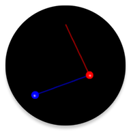

# Pendulum Studio

This repository contains the source code of the Pendulum Studio app, badly updated for modern versions of Android up to API 35 (Android 15) and down to API 15 (Android 4.0.3).

It is designed to be used in Android Studio with Gradle.

## What was updated?
- Changed compileSdkVersion from 25 (Android 7.1) to 34 (Android 14)
- Changed minSdkVersion from 9 (Android 2.3) to 15 (Android 4.0.3)
- Changed targetSdkVersion from 28 (Android 9) to 34 (Android 14)
- Updated some dependencies
- Using Theme.AppCompat instead of Theme.Holo.Light

## Short description of the app 
The app simulates the motion of various pendulum systems in real-time and renders it on the screen of an Android device. 
The Euler-Lagrange equations of motion for a chosen system are solved numerically by applying the Runge-Kutta-Fehlberg method at each time step.
The visualization is performed using OpenGL.

#### List of systems:
- Mathematical pendulum (2D)
- Pendulum wave effect (3D)
- Spherical pendulum (3D)
- Spring pendulum (2D)
- Spring pendulum (3D)
- Double pendulum (2D)
- Double spherical pendulum (3D)
- Spring-mathematical pendulum (2D)
- Spring-spherical pendulum (3D)

#### Some features:
- Option to use accelerometer of the device as the input of gravity force
- Using fingers to interactively change positions of pendulums (for 2D systems only)
- Damping force to simulate friction
- Regulation of all system parameters
- Customize pendulum colors (using the [ColorPickerView](https://github.com/danielnilsson9/color-picker-view) library by Daniel Nillson)
- Live wallpaper

## License
This software is licensed under the Apache License 2.0. See the [LICENSE](LICENSE) file for more information.

*Copyright (C) 2015-2018  Volodymyr Vovchenko*  
*Updated source by iKarTehFox*

